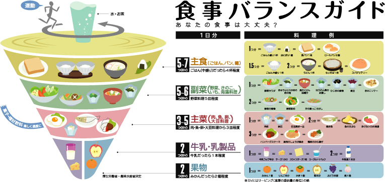

---
## 本日の内容

>-  病気と食事・栄養素
    - 欠乏症
    - 生活習慣病

>-  食事調査と栄養疫学研究
    - 日本人の食事摂取基準
    - 国民健康・栄養調査

--- &radio

食事バランスガイドのイラストの説明について

fjdkalfjadk;

1. _ddd_
2. gerald

*** .explanation
afjdkaljfkal;j

---

## Slide Title

This is a simple slide to illustrate the use of speaker notes.

*** pnotes

I need to focus on the following

- Point 1
- Point 2
- Point 3
