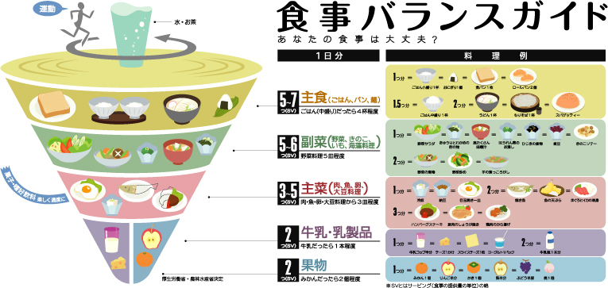
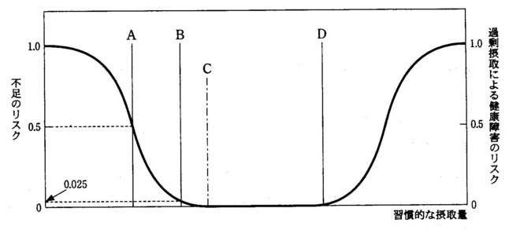
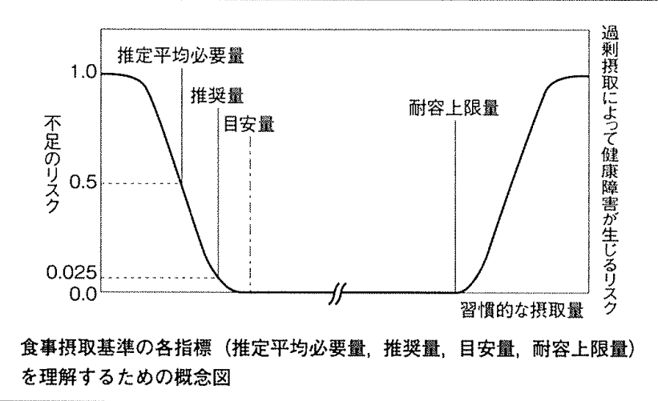

---

## 本日の内容

>-  病気と食事・栄養素
    - 欠乏症
    - 生活習慣病

>-  食事調査と栄養疫学研究
    - 日本人の食事摂取基準
    - 国民健康・栄養調査

--- .segue bg:black

# 栄養素欠乏症  Nutritional Deficiency

--- &radio

**国試108E7:** 食事バランスガイドのイラストを次に示す．説明として，**適切**なのはどれか？

1. 「糖尿病患者の献立がわかります」
2. 「食材を無駄にしないために使います」
3. 「検査のための食事の選択に利用します」
4. 「日常の活動に見合った運動がわかります」
5. _「何をどれだけ食べたらよいか示しています」_

*** .explanation
1. ✗特定の疾患の患者に対する指導を目的としたものではない，糖尿病では，エネルギー管理が重要であることから，[「糖尿病食事療法のための食品交換表」](https://www.amazon.co.jp/%E7%B3%96%E5%B0%BF%E7%97%85%E9%A3%9F%E4%BA%8B%E7%99%82%E6%B3%95%E3%81%AE%E3%81%9F%E3%82%81%E3%81%AE%E9%A3%9F%E5%93%81%E4%BA%A4%E6%8F%9B%E8%A1%A8-%E7%AC%AC7%E7%89%88-%E6%97%A5%E6%9C%AC%E7%B3%96%E5%B0%BF%E7%97%85%E5%AD%A6%E4%BC%9A/dp/4830660465)などが用いられる．
2. ✗食を環境問題という観点から考え，食品ロスを削減することも重要な課題であるが，食事バランスガイドは直接そのことを目的とはしていない．
3. ✗医療現場いおける検査のための特別な食事を示したものではない．
4. ✗コマの上の走る人は，身体活動によるエネルギー消費を概念的に示したものであるが，具体的にな身体活動や運動量を示したものではない.
5. ◯5つの料理区分について，一日に摂る食事量の目安をイラストで示してる．「食事のバランスガイド」は，**「何を」「どれだけ」食べたらよいかの目安**を，料理のイラストとして示している．患者や検査といった特殊なケースを想定したものではなく，一般的な指導や教育のためのツールである．なお，身体活動（運動を含む）については，[「健康づくりのための身体活動指針(アクティブガイド)」](http://www.mhlw.go.jp/stf/houdou/2r9852000002xple.html)で示されている．

--- &radio

**国試96G26:**  日本人の食事摂取基準について**誤っている**のはどれか．

1. 生活習慣の予防を重視している．
2. エネルギーについて指標が示されている．
3. 無機質について示されている．
4. _糖尿病患者が対象に含まれる．_
5. 年齢層別に示されている．

*** .hint
**エネルギーの指標** 
体格: BMI: Body Mass Index = weight $\div$ height$^2$ 
[エネルギー摂取量・消費量のバランス（エネルギー収支バランス）の維持を示す指標として，「体格(BMI)」が採用された．](https://www.danone-institute.or.jp/mailmagazine/backyear/2014/594-111-3.html)

年齢（歳） | 目標とするBMI(kg/m$^2$)
-----------|------------------------
18~49      | 18.5~24.9
50~69      | 20.0~24.9
70以上     | 21.5~24.9

*** .explanation
1. ✗生活習慣病予防を重視し，「摂取量の範囲」を示して，その範囲内にあれば生活習慣病のリスクが低いとする考え方を導入した．
2. ✗エネルギー収支バランスの維持を示す指標として「体格(BMI)」が示されている．
3. ✗マグネシウム，カルシウム，リンなどについて示されている．
4. ◯健康な人や集団を対象としている．
5. ✗年齢層別・男女別に示されている．

--- &checkbox

下図は｢食事摂取基準｣の各指標を理解するための模式図である．解説として**正しい**のはどれか，**2つ**を選べ．

1. _Aは､ 50％の者に欠乏のリスクが考えられる値である．_
2. _Bは、集団を対象にした場合､評価の指標にはならない．_
3. Cは､ 推定平均必要量に標準偏差の2倍を加えた値である．
4. Dは､ すべての栄養素において設定されている｡

*** .explanation
1. ◯推定平均必要量(EAR, estimated average requirement): 母集団の50%が必要量を満たすと推定される1日の摂取量
1. ◯[推奨量(RDA, recommended dietary allowance): 母集団のほとんど(97%~98%)が必要量を満たすと推定される1日の摂取量](http://ameblo.jp/peachf4/entry1.11949665641.html)
1. ✗目安量(AI, adequate intake): 不足状態を示す人がほとんど観察されない（摂取されていない）量
1. ✗耐容上限量(UL, tolerable upper intake level): 過剰摂取による健康障害に罹患しない最大限の量
1. ✗[目標量(DG, tentative dietary goal for preventing life1.style related diseases): 生活習慣病の一時予防のために当面の目標とすべき摂取量 「不足」「過剰」のリスクとは異なり，生活習慣病のリスクを下げることを目的としたものである．図中には示していない．](http://www.kokushi.space/?p=788)

---
## 栄養素の5つの指標

---
###  [食事摂取基準を用いた栄養素摂取量の評価（アセスメント）](http://www.mhlw.go.jp/houdou/2004/11/h1122-2c.html)
ー                    | 個人                                                                                                                    | 集団
----------------------|------------------------------------------------------------------------------------------------------------------------------------------------------------------|-------------------------------------------------------------------------------------------------------------------------
EAR | 摂取量がEAR以下の者は不足している確率が５０％以上；摂取量がEARより低くなるにつれて不足している確率が高くなっていく | 摂取量がEAR以下の者の割合は不足者の割合とほぼ一致する。
RDA         | 摂取量がEAR以上となりRDAに近づくにつれて不足している確率は低くなりRDAになれば、不足している確率は低い(2.5％)                        | 用いない。
AI          | 摂取量がAI以上の者は、不足している確率は非常に低い。                                                                                                 | 集団における摂取量の中央値がAI以上の場合は不足者の割合は少ない。摂取量の中央値がAI未満の場合には判断できない。
UL          | 摂取量がUL以上になり、高くなるにつれて、過剰摂取に由来する健康障害のリスクが高くなる。                                                               |摂取量がULを上回っている者の割合は、過剰摂取による健康障害のリスクをもっている者の割合と一致する。
DG          | 摂取量がDGに達しているか、示された範囲内にあれば、当該生活習慣病のリスクは低い。                                                                     | DGに達していない者の割合は、当該生活習慣病のリスクが高い者の割合と一致する。

--- &radio

**国試105E1:** 身体活動レベルⅢの30歳の男性の1日摂取目標量として，**適切**なのはどれか．

1. 鉄　1 mg
2. 脂質　150 g
3. 糖質　100 g
4. _蛋白質　70 g_
5. カルシウム　200 mg

*** .hint
問われているのは，栄養素の細かい知識ではなく，輸液栄養療法に通じる基本的な考え方である．脂質を含むエネルギー比率，鉄やカルシウムなどの過剰あるいは不足になりがちな栄養素について問われており，正解以外は適切でないと即座に判断できると良い．

*** .explanation
1. ✗鉄の1日の損失量が約1mgである．吸収率が10%程度であるため，摂取量として10mgが必要である．
2. ✗脂質のエネルギー比率は約25%程度(20~30%)である．身体活動レベルⅢの成人男性のエネルギー必要量は約3,000kcalと計算されるので，約25%を脂質で摂取する場合は，$3000 kcal\times25\%\div9kcal/g\approx83g$　となり，150g(エネルギー比率45%)は明らかに過剰である．
3. ✗糖質のエネルギー比率は50~70%である．3000kcalの約半分を糖質で摂取する場合は，$3000kcal\times50\%\div4kcal/g=375g$ となり，100gはエネルギー比率13%である．
4. ◯蛋白質の摂取量は体重1kgあたり約1gと覚えておけばよい．腎不全の低蛋白療法は理想体重1kgあたり0.6~0.8gを目安とすることも参考になる．
5. ✗カルシウムの摂取目標量は概ね600mg以上である．栄養過剰な日本人にあって，カルシウムの摂取は不足していることも覚えておく．

--- &radio

**国試107B61:**55歳の男性，職場の定期健康診断のあと，職場の医務室を訪れた．身長165cm，体重70kg，健康診断では，肥満以外に特記すべき所見を指摘されなかった．仕事は事務作業で，勤務中はほとんどの時間を机に向かって，過ごしている．通勤には自家用車を使っている．勤務の都合で運動する時間を確保するが難しいため，現在の身体活動レベルのまま，BMIが22となる体重目標に減量することにした．55歳の男性の基礎代謝基準値は21.5 kcal/kg/日である．また，推定エネルギー必要量と基礎代謝の比は，身体活動レベルがⅠ(低い)なら1.50，Ⅱ(ふつう)なら1.75，Ⅲ(高い)なら2.00である．この受診者に提示する一日の推定エネルギー必要量(kcal)を求めるための計算式はどれか．

1. $22\times21.5\times1.50$
2. $70\times1.65\times1.65\times21.5\times1.75$
3. $22\times21.5\times2.00$
4. _$22\times1.65\times1.65\times21.5\times1.50$_

*** .explanation
1. ある個人における1日のエネルギー消費量を推定し，それに基づき必要な摂取エネルギー量（推定エネルギー必要量）を提示するという問題設定である．
2. EER(estimated energy requirement): 推定エネルギー必要量(kcal/日)  $=$ 基礎代謝基準値 $\times$ 基準体重 $\times$ 身体活動レベル   $=21.5\times[22\times1.65\times1.65]\times1.50$

--- 

## interactive console 

<!DOCTYPE html PUBLIC "-//W3C//DTD XHTML 1.0 Strict//EN"
  "http://www.w3.org/TR/xhtml1/DTD/xhtml1-strict.dtd">
<html xmlns="http://www.w3.org/1999/xhtml">
<head>
<title>MotionChartID29b64a311e1c</title>
<meta http-equiv="content-type" content="text/html;charset=utf-8" />

</head>
<body>
 <!-- MotionChart generated in R 3.3.3 by googleVis 0.6.2 package -->
<!-- Fri Apr  7 15:48:30 2017 -->

<!-- jsHeader -->

 
<!-- jsChart -->  

 
<!-- divChart -->
  

 
Data: EI &#8226; Chart ID: <a href="Chart_MotionChartID29b64a311e1c.html">MotionChartID29b64a311e1c</a> &#8226; <a href="https://github.com/mages/googleVis">googleVis-0.6.2</a>  
<!-- htmlFooter -->
 
  R version 3.3.3 (2017-03-06) 
  &#8226; <a href="https://developers.google.com/terms/">Google Terms of Use</a> &#8226; <a href="https://google-developers.appspot.com/chart/interactive/docs/gallery/motionchart">Documentation and Data Policy</a>

</body>
</html>

---
