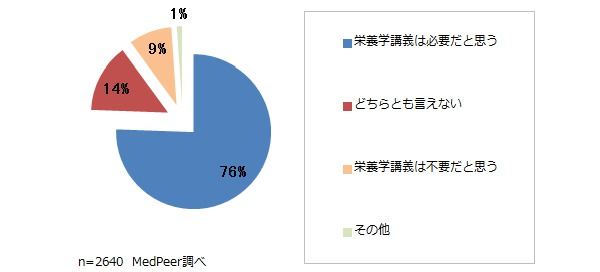
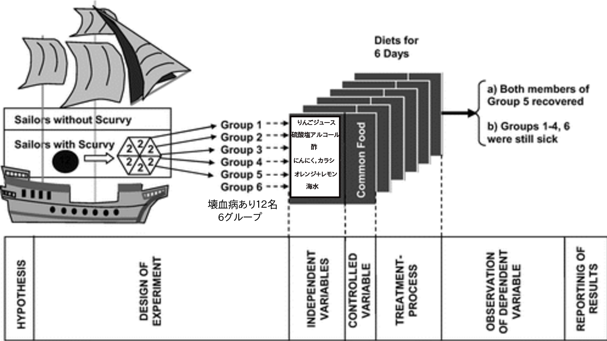
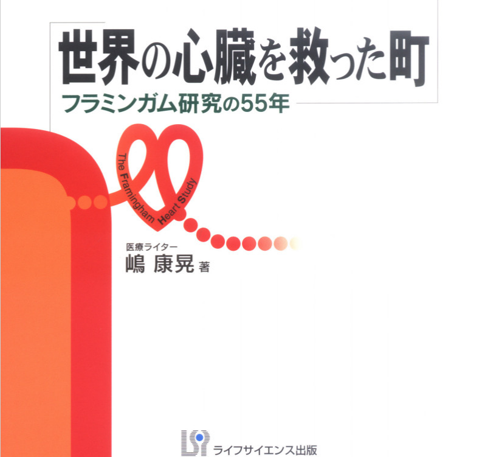
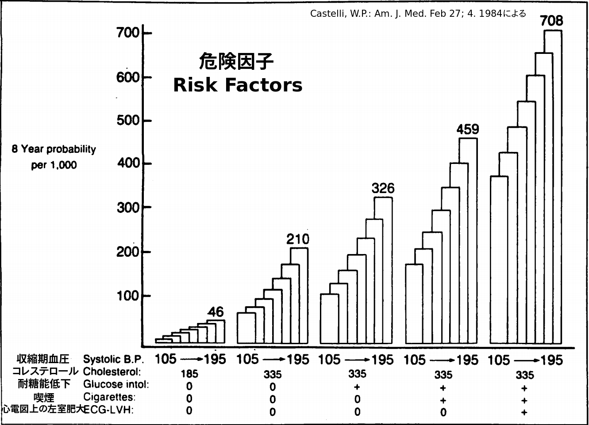
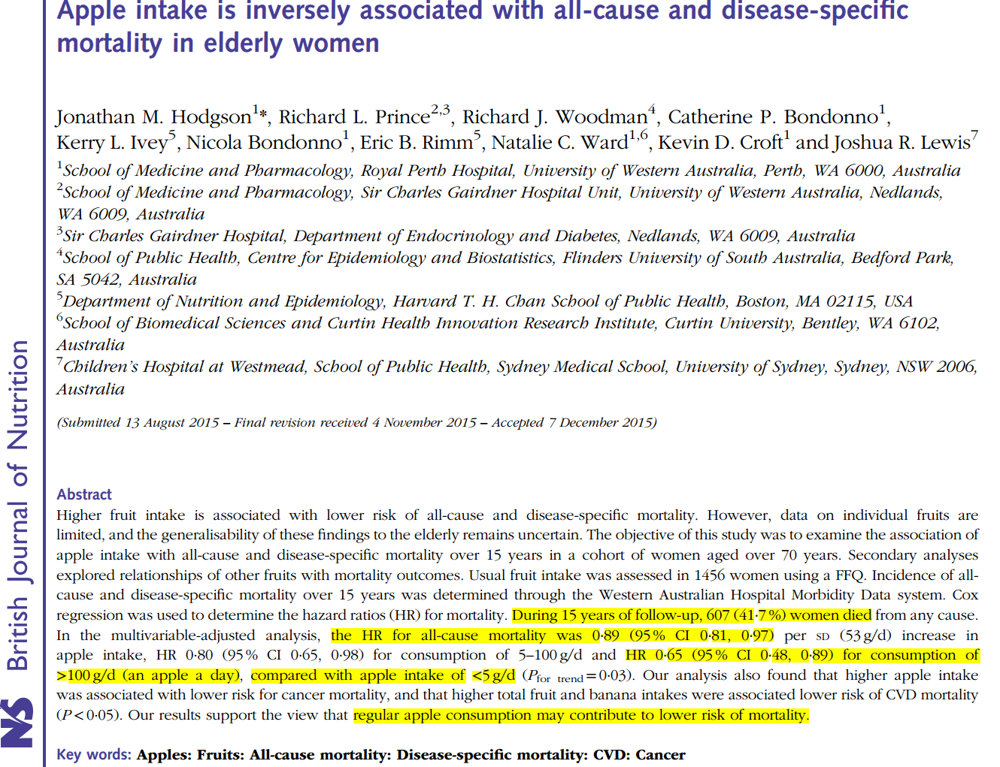
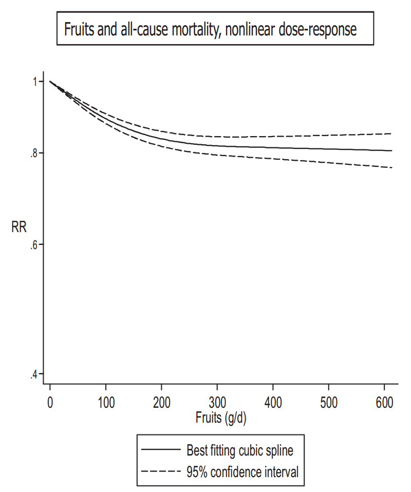
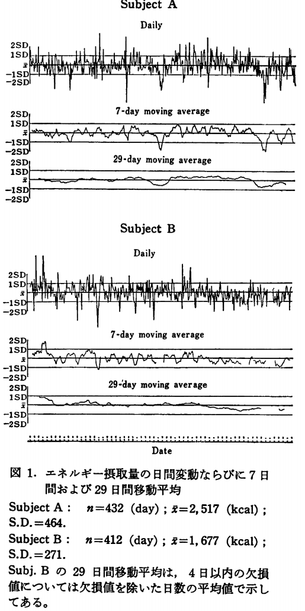
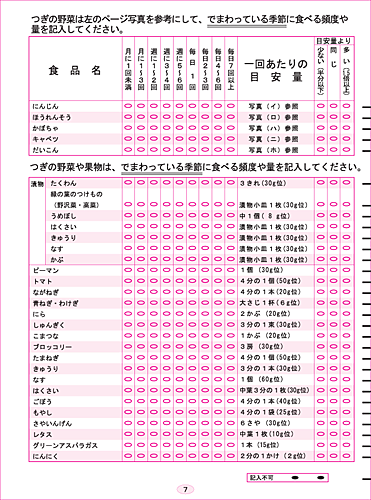

---
## 7割の医師が栄養学の重要性を実感
### - [医学部の栄養学講義についての調査](http://news.mynavi.jp/news/2012/05/22/069/)

* 「生活習慣病の増加に伴い，必要性が高まっている」
* 「食事療法を指導する上では必須」
* 「患者さんから食事関係の質問が多い」というものがあった．

--- &twocol

## 栄養学を知る
> 食は生命なり
>  「食事を通して栄養学を日々の暮らしに根付かせることが，人々の健康な生活につながる」

*** =left
###  病気と食事・栄養素

   - 欠乏症
   - 生活習慣病
   

*** =right
###  食事調査と栄養疫学入門

* 国民健康・栄養調査
* 日本人の食事摂取基準
   

--- &radio
## 栄養素欠乏症

**国試105G8** 栄養素とその欠乏によって起こる病態との組み合わせで正しいのはどれか．

1. マグネシウム --- 味覚障害
2. ビタミンA --- ペラグラ
3. _ビタミンC --- 出血傾向_
4. カルシウム --- 貧血
5. 亜鉛 --- 夜盲

*** .explanation
1. 味覚障害は亜鉛欠乏によって起こる．
2. ペラグラはナイアシン欠乏によって起こる．
3. ビタミン C はコラーゲンと血管壁の結合組織を作るのに関与する．したがって，その欠乏により壊血病，すなわち血管壁の脆弱化が見られやすくなる．
4. 貧血は，鉄（小球性低色素性貧血）や ビタミンB$_{12}$欠乏症（巨赤芽球性貧血）によって起こる．
5. 夜盲症はビタミン A 欠乏によって起こる．

--- #custbg1

飢餓による栄養失調症

--- #custbg2

---
## くる病

--- &twocol
## [ジェイムズ・リンド(James Lind, 1716-1794)](https://ja.wikipedia.org/wiki/%E3%82%B8%E3%82%A7%E3%83%BC%E3%83%A0%E3%82%BA%E3%83%BB%E3%83%AA%E3%83%B3%E3%83%89)

*** =left

*** =right
  
>- **世界初の症例対象研究**
  
>- 

--- &twocol

 
> 歯肉は 歯根のあたりまで腐り，頬は硬く腫れ上がって，ぐらつく歯は今にも抜けそうになる．...... 息は臭く，足には力が入らず，体のいたるところが疼き，青や赤のあざができる．

*** =left
 

*** =right
   

--- &twocol
## イギリス水兵のあだ名：[limey](http://eigo-kobako.blog.so-net.ne.jp/2013-05-27) ライム果汁を飲んでいたから

*** =left
### 当時の医師が提案した治療法
- 瀉血
- 水銀剤
- 塩水
- 酢
- 硫酸
- 塩酸
- モーゼル・ワイン　
- 重労働　　などなど

*** =right
   

---
## リンドの実験
 

--- #custbg4

        
  
<strong>
環境と食事という変数を変えてみただけ 人数はわずかだが，結果は明白 リンドは，ビタミン C の存在すら知らなかった 医療においては，治療の有効性を示すことが最優先
</strong>

--- &twocol
## 高木兼寛(1849-1920)の貢献

*** =left
 

*** =right
### [高木兼寛の「勘」](http://kumadai-publich.com/topics/post_10.html)
- 19世紀は「菌」の世紀だが，「白米」に注目
- 貧困層に少なく，富裕層に多い
- 刑務所の服役囚では極めで少ない
- 「食べ物の中にの窒素と炭素のアンバランス」ではないか
- 大麦，大豆，牛肉を多くする食事を海軍に推奨した

---
 
> 食欲不振があり，他に全身がだるく，とくに下半身に倦怠感が生まれる．足のしびれやむくみ，動悸，息切れ，感覚が麻痺するなどの症状があらわれます．さらに進行すると手足に力が入らず寝たきりとなり，そのまま放置すると心不全を起こして死に至ることもある．
> 膝の下を叩いても足が跳ね上がらない．

 

--- #custbg3

---
高木兼寛は脚気を撲滅したが，真の原因 ビタミンB$_1$の存在すら知らなかった．
   

   
> 南極大陸に世界の著名な栄養学者の名前を冠した7つの岬がある．一つは，高木岬である．
> 高木の業績を世界は認めている．

--- &radio2
## 生活習慣病

**国試100G63:** 三大栄養素の過剰摂取が関係するのはどれか．

1. _脂質異常症_
2. Ⅰ型糖尿病
3. 巨赤芽球性貧血
4. 高カルシウム血症
5. 甲状腺機能亢進症

*** =image

*** .hint
三大栄養素は，蛋白質，脂質，炭水化物（糖）であり，主栄養素(macronutrient)とも呼ばれる．

*** .explanation
1. ◯ 特に飽和脂肪酸，コレステロールの過剰摂取は脂質異常症の原因と言われる．
2. ✗ Ⅱ型糖尿病は，エネルギーや脂質の過剰摂取などがあるが，Ⅰ型糖尿病は自己免疫性と考えられている．
3. ✗ 主な原因はビタミンB$_{12}$や葉酸の欠乏である．
4. ✗ 副甲状腺機能亢進症，悪性腫瘍に伴うもの，サルコイドーシスなどの他に，栄養関連ではビタミンD過剰症が原因となる．
5. ✗ ヨード欠乏は甲状腺機能低下の原因となる．また，ヨードが欠乏している地域において，急にヨードが行き渡るようになると甲状腺機能亢進症が多発することが知られている．

---

---
### 40歳男子を18年間経過観察しての心臓病のリスク

--- &twocol
## An apple a day keeps the doctor away.

*** =left
 
>- 
>- 1日1個のリンゴは医者を遠ざける．

*** =right
 
>- 
>- アップル製品を一日中遊んでる人は一生医者になれない．
>- 

---

--- #custbg5

--- &twocol
### 果物摂取量と循環器疾患死亡・総死亡
Aune, D. et al. Int J Epidemiol (2017).

*** =left

*** =right

---
### [主要部位のがんと食物・栄養素との関連](https://www.google.co.jp/url?sa=t&rct=j&q=&esrc=s&source=web&cd=3&ved=0ahUKEwjai5T175vTAhUCwrwKHRWhA30QFggsMAI&url=http%3A%2F%2Fwww.wcrf.org%2Fsites%2Fdefault%2Ffiles%2FSER-SUMMARY-%2528Japanese%2529.pdf&usg=AFQjCNFpuC6MMlivkMjAIkEdANjcDnw6CA&sig2=ZUKE3DcUhOCOBp5CDElmug&bvm=bv.152180690,d.dGc&cad=rja)

関連の強さ                                     | リスクを下げるもの                                                                                                                                                                               | リスクを上げるもの
-----------------------------------------------|-------------------------------------------------------------------------------------------------------------------------------------------------------------------------------------------------|----------------------------------------------------------------------------------------------------------------------------------------------------
確実 (convincing)                               | 身体活動（結腸）                                                                                                                                                                                 | 過体重と肥満（食道，結腸，直腸，乳房（閉経後），子宮，腎臓）;飲酒（口腔，咽頭，喉頭，食道，肝臓，乳房）;アフラトキシン（肝臓）;中国式塩蔵魚（鼻咽頭）
可能性大 (Probable)                             | 野菜・果物（口腔，食道，胃，結腸，直腸）;身体活動（乳房）                                                                                                                                         | 貯蔵肉（結腸，直腸）;塩蔵品および食塩（胃）;熱い 飲食物（口腔， 咽頭，食道）
可能性あり/データ不十分 (Possible/Insufficient) | 食物繊維 大豆 魚 $\omega$-3 系脂肪酸，カロテノイド，ビタミンB2，B6，葉酸，B12，C，D，Eカルシウム，亜鉛，セレン，非栄養性植物機能成分（例：アリウム化合物，フラボノイド，イソフラボン，リグナン） | 動物性脂肪，ヘテロサイクリックアミン，多環芳香族炭化水素，ニトロソ化合物

--- &twocol
## 食事調査(dietary assessment)
*** =left
>- 食べているものは日々変わっている．その内容や量は毎日少しずつ違っている．
>- 季節によって食べ物も変わる．

  

*** =right
 

---
## 食事調査の種類：
  

調査法  |　メリット   | デメリット
:--|:---|:--
陰膳法 (duplicate method) |・記憶に依存しない　  ・食品成分表の精度に依存しない |  ・負担が大きい  ・食事が通常と異なる ・手間と費用がかかる
||
食事記録法 (diet record)  |・記憶に依存しない |・負担が大きい ・食事が通常と異なる
||
24時間食事思い出し法 (diet recall)|・負担が小さい|・記憶に依存する
||
食物摂取頻度調査法 (food frequency method)|・簡単 ・時間と労力が少ない|・結果は限られる

--- &twocol
## 国民健康・栄養調査

*** =left

>- **健康増進法**に基づき（平成15年から, 2003年）．
>- 目的：国民の**身体状況，栄養素摂取量，生活習慣**を明らかにする．
>- **毎年**，全国から約5千世帯とその世帯員約1万5千人を対象に実施されている．

 
>- 

*** =right

>- 身体状況調査票:  身長や体重（満１歳以上）; 腹囲（満６歳以上）; 血圧（満15歳以上）; 血液検査（満20歳以上）; １日の運動量（満15歳以上）※歩行数; 問診
>- 栄養摂取状況調査票（満１歳以上）
  + 世帯の食事摂取量を**秤量法**を用いて調査し
  + **案分比例「あんぶんひりつ」法**にて個人あたりの摂取量を算出します．

--- #custbg6

--- #custbg7

--- &twocol
## 食物摂取頻度調査票(例)
*** =left
  

*** =right

---
## [平成27年調査の結果の概要](http://www.mhlw.go.jp/stf/houdou/0000142359.html)

- 若い世代ほど栄養バランスに課題
  + 主食・主菜・副菜を組み合わせた食事は，若い世代ほど食べられていない傾向にあり，外食や中食の利用割合が高い．（５頁，７頁）
  + 20～30歳代の女性では，たんぱく質，カルシウム，食物繊維及びカリウムなどの摂取量が，60歳以上に比べて少ない傾向．（39頁，41-43頁）
- 受動喫煙の機会は「飲食店」が最も高く４割超
  + 受動喫煙の機会を有する者の割合について場所別にみると，「飲食店」では41.4％と最も高く，次いで「遊技場」では33.4％，「職場」では30.9％．（15頁）
- 1日の平均睡眠時間が６時間未満の割合が増加
  + 1日の平均睡眠時間が６時間未満の割合は，ここ数年で増加傾向にあり，睡眠の妨げになっていることは，男性では「仕事」，女性では「育児」「家事」（27頁，13頁）

---

## 総エネルギー摂取量(kcal/d) 1995-2015

<!DOCTYPE html PUBLIC "-//W3C//DTD XHTML 1.0 Strict//EN"
  "http://www.w3.org/TR/xhtml1/DTD/xhtml1-strict.dtd">
<html xmlns="http://www.w3.org/1999/xhtml">
<head>
<title>MotionChartID72cd1f73653c</title>
<meta http-equiv="content-type" content="text/html;charset=utf-8" />

</head>
<body>
 <!-- MotionChart generated in R 3.3.3 by googleVis 0.6.2 package -->
<!-- Wed Apr 12 10:35:19 2017 -->

<!-- jsHeader -->

 
<!-- jsChart -->  

 
<!-- divChart -->
  

 
Data: EI &#8226; Chart ID: <a href="Chart_MotionChartID72cd1f73653c.html">MotionChartID72cd1f73653c</a> &#8226; <a href="https://github.com/mages/googleVis">googleVis-0.6.2</a>  
<!-- htmlFooter -->
 
  R version 3.3.3 (2017-03-06) 
  &#8226; <a href="https://developers.google.com/terms/">Google Terms of Use</a> &#8226; <a href="https://google-developers.appspot.com/chart/interactive/docs/gallery/motionchart">Documentation and Data Policy</a>

</body>
</html>

---

## 蛋白質摂取量(g/d) 1995-2015

<!DOCTYPE html PUBLIC "-//W3C//DTD XHTML 1.0 Strict//EN"
  "http://www.w3.org/TR/xhtml1/DTD/xhtml1-strict.dtd">
<html xmlns="http://www.w3.org/1999/xhtml">
<head>
<title>MotionChartID72cd28182987</title>
<meta http-equiv="content-type" content="text/html;charset=utf-8" />

</head>
<body>
 <!-- MotionChart generated in R 3.3.3 by googleVis 0.6.2 package -->
<!-- Wed Apr 12 10:35:19 2017 -->

<!-- jsHeader -->

 
<!-- jsChart -->  

 
<!-- divChart -->
  

 
Data: Pro &#8226; Chart ID: <a href="Chart_MotionChartID72cd28182987.html">MotionChartID72cd28182987</a> &#8226; <a href="https://github.com/mages/googleVis">googleVis-0.6.2</a>  
<!-- htmlFooter -->
 
  R version 3.3.3 (2017-03-06) 
  &#8226; <a href="https://developers.google.com/terms/">Google Terms of Use</a> &#8226; <a href="https://google-developers.appspot.com/chart/interactive/docs/gallery/motionchart">Documentation and Data Policy</a>

</body>
</html>

---

## 脂質摂取量(g/d) 1995-2015

<!DOCTYPE html PUBLIC "-//W3C//DTD XHTML 1.0 Strict//EN"
  "http://www.w3.org/TR/xhtml1/DTD/xhtml1-strict.dtd">
<html xmlns="http://www.w3.org/1999/xhtml">
<head>
<title>MotionChartID72cd1723a92</title>
<meta http-equiv="content-type" content="text/html;charset=utf-8" />

</head>
<body>
 <!-- MotionChart generated in R 3.3.3 by googleVis 0.6.2 package -->
<!-- Wed Apr 12 10:35:19 2017 -->

<!-- jsHeader -->

 
<!-- jsChart -->  

 
<!-- divChart -->
  

 
Data: Fat &#8226; Chart ID: <a href="Chart_MotionChartID72cd1723a92.html">MotionChartID72cd1723a92</a> &#8226; <a href="https://github.com/mages/googleVis">googleVis-0.6.2</a>  
<!-- htmlFooter -->
 
  R version 3.3.3 (2017-03-06) 
  &#8226; <a href="https://developers.google.com/terms/">Google Terms of Use</a> &#8226; <a href="https://google-developers.appspot.com/chart/interactive/docs/gallery/motionchart">Documentation and Data Policy</a>

</body>
</html>

---

## 炭水化物摂取量(g/d) 1995-2015

<!DOCTYPE html PUBLIC "-//W3C//DTD XHTML 1.0 Strict//EN"
  "http://www.w3.org/TR/xhtml1/DTD/xhtml1-strict.dtd">
<html xmlns="http://www.w3.org/1999/xhtml">
<head>
<title>MotionChartID72cd5fc48817</title>
<meta http-equiv="content-type" content="text/html;charset=utf-8" />

</head>
<body>
 <!-- MotionChart generated in R 3.3.3 by googleVis 0.6.2 package -->
<!-- Wed Apr 12 10:35:19 2017 -->

<!-- jsHeader -->

 
<!-- jsChart -->  

 
<!-- divChart -->
  

 
Data: Carbon &#8226; Chart ID: <a href="Chart_MotionChartID72cd5fc48817.html">MotionChartID72cd5fc48817</a> &#8226; <a href="https://github.com/mages/googleVis">googleVis-0.6.2</a>  
<!-- htmlFooter -->
 
  R version 3.3.3 (2017-03-06) 
  &#8226; <a href="https://developers.google.com/terms/">Google Terms of Use</a> &#8226; <a href="https://google-developers.appspot.com/chart/interactive/docs/gallery/motionchart">Documentation and Data Policy</a>

</body>
</html>

--- &radio

**国試96G26:**  日本人の食事摂取基準について**誤っている**のはどれか．

1. 生活習慣の予防を重視している．
2. エネルギーについて指標が示されている．
3. 無機質について示されている．
4. _糖尿病患者が対象に含まれる．_
5. 年齢層別に示されている．

*** .hint
**エネルギーの指標** 
体格: BMI: Body Mass Index = weight $\div$ height$^2$ 
[エネルギー摂取量・消費量のバランス（エネルギー収支バランス）の維持を示す指標として，「体格(BMI)」が採用された．](https://www.danone-institute.or.jp/mailmagazine/backyear/2014/594-111-3.html)

年齢（歳） | 目標とするBMI(kg/m$^2$)
-----------|------------------------
18~49      | 18.5~24.9
50~69      | 20.0~24.9
70以上     | 21.5~24.9

*** .explanation
1. ✗生活習慣病予防を重視し，「摂取量の範囲」を示して，その範囲内にあれば生活習慣病のリスクが低いとする考え方を導入した．
2. ✗エネルギー収支バランスの維持を示す指標として「体格(BMI)」が示されている．
3. ✗マグネシウム，カルシウム，リンなどについて示されている．
4. ◯健康な人や集団を対象としている．
5. ✗年齢層別・男女別に示されている．

--- &checkbox

下図は｢食事摂取基準｣の各指標を理解するための模式図である．解説として**正しい**のはどれか，**2つ**を選べ．

1. _Aは､ 50％の者に欠乏のリスクが考えられる値である．_
2. _Bは，集団を対象にした場合､評価の指標にはならない．_
3. Cは､ 推定平均必要量に標準偏差の2倍を加えた値である．
4. Dは､ すべての栄養素において設定されている｡

*** .explanation
1. ◯推定平均必要量(EAR, estimated average requirement): 母集団の50%が必要量を満たすと推定される1日の摂取量
1. ◯[推奨量(RDA, recommended dietary allowance): 母集団のほとんど(97%~98%)が必要量を満たすと推定される1日の摂取量](http://ameblo.jp/peachf4/entry1.11949665641.html)
1. ✗目安量(AI, adequate intake): 不足状態を示す人がほとんど観察されない（摂取されていない）量
1. ✗耐容上限量(UL, tolerable upper intake level): 過剰摂取による健康障害に罹患しない最大限の量
1. ✗[目標量(DG, tentative dietary goal for preventing life1.style related diseases): 生活習慣病の一時予防のために当面の目標とすべき摂取量 「不足」「過剰」のリスクとは異なり，生活習慣病のリスクを下げることを目的としたものである．図中には示していない．](http://www.kokushi.space/?p=788)

-- &radio

*国試108E7:** 食事バランスガイドのイラストを次に示す．説明として，**適切**なのはどれか？

1. 「糖尿病患者の献立がわかります」
2. 「食材を無駄にしないために使います」
3. 「検査のための食事の選択に利用します」
4. 「日常の活動に見合った運動がわかります」
5. _「何をどれだけ食べたらよいか示しています」_

*** .explanation
1. ✗特定の疾患の患者に対する指導を目的としたものではない，糖尿病では，エネルギー管理が重要であることから，[「糖尿病食事療法のための食品交換表」](https://www.amazon.co.jp/%E7%B3%96%E5%B0%BF%E7%97%85%E9%A3%9F%E4%BA%8B%E7%99%82%E6%B3%95%E3%81%AE%E3%81%9F%E3%82%81%E3%81%AE%E9%A3%9F%E5%93%81%E4%BA%A4%E6%8F%9B%E8%A1%A8-%E7%AC%AC7%E7%89%88-%E6%97%A5%E6%9C%AC%E7%B3%96%E5%B0%BF%E7%97%85%E5%AD%A6%E4%BC%9A/dp/4830660465)などが用いられる．
2. ✗食を環境問題という観点から考え，食品ロスを削減することも重要な課題であるが，食事バランスガイドは直接そのことを目的とはしていない．
3. ✗医療現場いおける検査のための特別な食事を示したものではない．
4. ✗コマの上の走る人は，身体活動によるエネルギー消費を概念的に示したものであるが，具体的にな身体活動や運動量を示したものではない.
5. ◯5つの料理区分について，一日に摂る食事量の目安をイラストで示してる．「食事のバランスガイド」は，**「何を」「どれだけ」食べたらよいかの目安**を，料理のイラストとして示している．患者や検査といった特殊なケースを想定したものではなく，一般的な指導や教育のためのツールである．なお，身体活動（運動を含む）については，[「健康づくりのための身体活動指針(アクティブガイド)」](http://www.mhlw.go.jp/stf/houdou/2r9852000002xple.html)で示されている．

---
## 栄養素の5つの指標

---
###  [食事摂取基準を用いた栄養素摂取量の評価（アセスメント）](http://www.mhlw.go.jp/houdou/2004/11/h1122-2c.html)
ー                    | 個人                                                                                                                    | 集団
----------------------|------------------------------------------------------------------------------------------------------------------------------------------------------------------|-------------------------------------------------------------------------------------------------------------------------
EAR | 摂取量がEAR以下の者は不足している確率が５０％以上；摂取量がEARより低くなるにつれて不足している確率が高くなっていく | 摂取量がEAR以下の者の割合は不足者の割合とほぼ一致する．
RDA         | 摂取量がEAR以上となりRDAに近づくにつれて不足している確率は低くなりRDAになれば，不足している確率は低い(2.5％)                        | 用いない．
AI          | 摂取量がAI以上の者は，不足している確率は非常に低い．                                                                                                 | 集団における摂取量の中央値がAI以上の場合は不足者の割合は少ない．摂取量の中央値がAI未満の場合には判断できない．
UL          | 摂取量がUL以上になり，高くなるにつれて，過剰摂取に由来する健康障害のリスクが高くなる．                                                               |摂取量がULを上回っている者の割合は，過剰摂取による健康障害のリスクをもっている者の割合と一致する．
DG          | 摂取量がDGに達しているか，示された範囲内にあれば，当該生活習慣病のリスクは低い．                                                                     | DGに達していない者の割合は，当該生活習慣病のリスクが高い者の割合と一致する．

--- &radio

**国試105E1:** 身体活動レベルⅢの30歳の男性の1日摂取目標量として，**適切**なのはどれか．

1. 鉄　1 mg
2. 脂質　150 g
3. 糖質　100 g
4. _蛋白質　70 g_
5. カルシウム　200 mg

*** .hint
問われているのは，栄養素の細かい知識ではなく，輸液栄養療法に通じる基本的な考え方である．脂質を含むエネルギー比率，鉄やカルシウムなどの過剰あるいは不足になりがちな栄養素について問われており，正解以外は適切でないと即座に判断できると良い．

*** .explanation
1. ✗鉄の1日の損失量が約1mgである．吸収率が10%程度であるため，摂取量として10mgが必要である．
2. ✗脂質のエネルギー比率は約25%程度(20~30%)である．身体活動レベルⅢの成人男性のエネルギー必要量は約3,000kcalと計算されるので，約25%を脂質で摂取する場合は，$3000 kcal\times25\%\div9kcal/g\approx83g$　となり，150g(エネルギー比率45%)は明らかに過剰である．
3. ✗糖質のエネルギー比率は50~70%である．3000kcalの約半分を糖質で摂取する場合は，$3000kcal\times50\%\div4kcal/g=375g$ となり，100gはエネルギー比率13%である．
4. ◯蛋白質の摂取量は体重1kgあたり約1gと覚えておけばよい．腎不全の低蛋白療法は理想体重1kgあたり0.6~0.8gを目安とすることも参考になる．
5. ✗カルシウムの摂取目標量は概ね600mg以上である．栄養過剰な日本人にあって，カルシウムの摂取は不足していることも覚えておく．

--- &radio

**国試107B61:**55歳の男性，職場の定期健康診断のあと，職場の医務室を訪れた．身長165cm，体重70kg，健康診断では，肥満以外に特記すべき所見を指摘されなかった．仕事は事務作業で，勤務中はほとんどの時間を机に向かって，過ごしている．通勤には自家用車を使っている．勤務の都合で運動する時間を確保するが難しいため，現在の身体活動レベルのまま，BMIが22となる体重目標に減量することにした．55歳の男性の基礎代謝基準値は21.5 kcal/kg/日である．また，推定エネルギー必要量と基礎代謝の比は，身体活動レベルがⅠ(低い)なら1.50，Ⅱ(ふつう)なら1.75，Ⅲ(高い)なら2.00である．この受診者に提示する一日の推定エネルギー必要量(kcal)を求めるための計算式はどれか．

1. $22\times21.5\times1.50$
2. $70\times1.65\times1.65\times21.5\times1.75$
3. $22\times21.5\times2.00$
4. _$22\times1.65\times1.65\times21.5\times1.50$_

*** .explanation
1. ある個人における1日のエネルギー消費量を推定し，それに基づき必要な摂取エネルギー量（推定エネルギー必要量）を提示するという問題設定である．
2. EER(estimated energy requirement): 推定エネルギー必要量(kcal/日)  $=$ 基礎代謝基準値 $\times$ 基準体重 $\times$ 身体活動レベル   $=21.5\times[22\times1.65\times1.65]\times1.50$

---

## 三大栄養素エネルギー比率(全体)

<!DOCTYPE html PUBLIC "-//W3C//DTD XHTML 1.0 Strict//EN"
  "http://www.w3.org/TR/xhtml1/DTD/xhtml1-strict.dtd">
<html xmlns="http://www.w3.org/1999/xhtml">
<head>
<title>BarChartID72cd31cb947c</title>
<meta http-equiv="content-type" content="text/html;charset=utf-8" />

</head>
<body>
 <!-- BarChart generated in R 3.3.3 by googleVis 0.6.2 package -->
<!-- Wed Apr 12 10:35:19 2017 -->

<!-- jsHeader -->

 
<!-- jsChart -->  

 
<!-- divChart -->
  

 
Data: data &#8226; Chart ID: <a href="Chart_BarChartID72cd31cb947c.html">BarChartID72cd31cb947c</a> &#8226; <a href="https://github.com/mages/googleVis">googleVis-0.6.2</a>  
<!-- htmlFooter -->
 
  R version 3.3.3 (2017-03-06) 
  &#8226; <a href="https://developers.google.com/terms/">Google Terms of Use</a> &#8226; <a href="https://google-developers.appspot.com/chart/interactive/docs/gallery/barchart">Documentation and Data Policy</a>

</body>
</html>

---

## 三大栄養素エネルギー比率(男性)

<!DOCTYPE html PUBLIC "-//W3C//DTD XHTML 1.0 Strict//EN"
  "http://www.w3.org/TR/xhtml1/DTD/xhtml1-strict.dtd">
<html xmlns="http://www.w3.org/1999/xhtml">
<head>
<title>BarChartID72cd3faaece4</title>
<meta http-equiv="content-type" content="text/html;charset=utf-8" />

</head>
<body>
 <!-- BarChart generated in R 3.3.3 by googleVis 0.6.2 package -->
<!-- Wed Apr 12 10:35:19 2017 -->

<!-- jsHeader -->

 
<!-- jsChart -->  

 
<!-- divChart -->
  

 
Data: data &#8226; Chart ID: <a href="Chart_BarChartID72cd3faaece4.html">BarChartID72cd3faaece4</a> &#8226; <a href="https://github.com/mages/googleVis">googleVis-0.6.2</a>  
<!-- htmlFooter -->
 
  R version 3.3.3 (2017-03-06) 
  &#8226; <a href="https://developers.google.com/terms/">Google Terms of Use</a> &#8226; <a href="https://google-developers.appspot.com/chart/interactive/docs/gallery/barchart">Documentation and Data Policy</a>

</body>
</html>

---

## 三大栄養素エネルギー比率(女性)

<!DOCTYPE html PUBLIC "-//W3C//DTD XHTML 1.0 Strict//EN"
  "http://www.w3.org/TR/xhtml1/DTD/xhtml1-strict.dtd">
<html xmlns="http://www.w3.org/1999/xhtml">
<head>
<title>BarChartID72cd4392e5b</title>
<meta http-equiv="content-type" content="text/html;charset=utf-8" />

</head>
<body>
 <!-- BarChart generated in R 3.3.3 by googleVis 0.6.2 package -->
<!-- Wed Apr 12 10:35:19 2017 -->

<!-- jsHeader -->

 
<!-- jsChart -->  

 
<!-- divChart -->
  

 
Data: data &#8226; Chart ID: <a href="Chart_BarChartID72cd4392e5b.html">BarChartID72cd4392e5b</a> &#8226; <a href="https://github.com/mages/googleVis">googleVis-0.6.2</a>  
<!-- htmlFooter -->
 
  R version 3.3.3 (2017-03-06) 
  &#8226; <a href="https://developers.google.com/terms/">Google Terms of Use</a> &#8226; <a href="https://google-developers.appspot.com/chart/interactive/docs/gallery/barchart">Documentation and Data Policy</a>

</body>
</html>

